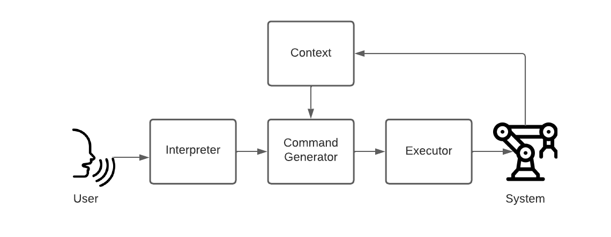

# GPT Dynamic Robotic Command Generation

## Esteban Padilla Cerdio

This repository is the official implementation of GPT Dynamic Robotic Command Generation (GDRCG) <br>

GDRCG is a research project aimed to createing a system that dynamically generates commands for robotic systems based on user input, by using the GPT language generation models. 




### Example
- <b>System</b>: Differential drive car with DC motors and a RaspberryPi controller.
- <b>Context</b>:
```python
import RPi.GPIO as GPIO
import time

class Robot:
	PORT_RIGHT_MOTOR_A = 0
	PORT_RIGHT_MOTOR_B = 1
	PORT_LEFT_MOTOR_A = 2
	PORT_LEFT_MOTOR_B = 3
	LEFT_SIDE_INVERTED = True
```
- <b>User command</b>: "Drive forward at max speed for 5 seconds"

- <b>Output</b>:<br>
```python
	def drive_forward_5_sec(self):
		GPIO.output(self.PORT_RIGHT_MOTOR_A, GPIO.HIGH)
		GPIO.output(self.PORT_RIGHT_MOTOR_B, GPIO.LOW)
		GPIO.output(self.PORT_LEFT_MOTOR_A, GPIO.LOW)
		GPIO.output(self.PORT_LEFT_MOTOR_B, GPIO.HIGH)

		time.sleep(5)

		GPIO.output(self.PORT_RIGHT_MOTOR_A, GPIO.LOW)
		GPIO.output(self.PORT_RIGHT_MOTOR_B, GPIO.LOW)
		GPIO.output(self.PORT_LEFT_MOTOR_A, GPIO.LOW)
		GPIO.output(self.PORT_LEFT_MOTOR_B, GPIO.LOW)
```
- <b>Execution</b>:
```python
robot.drive_forward_5_sec()
```
